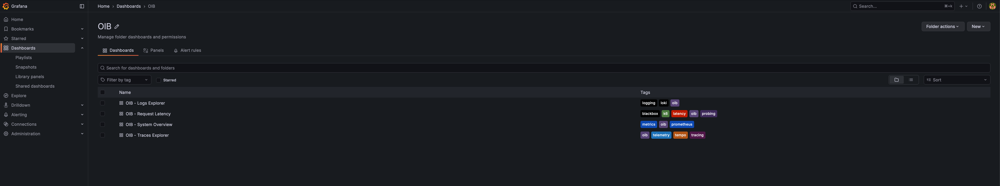
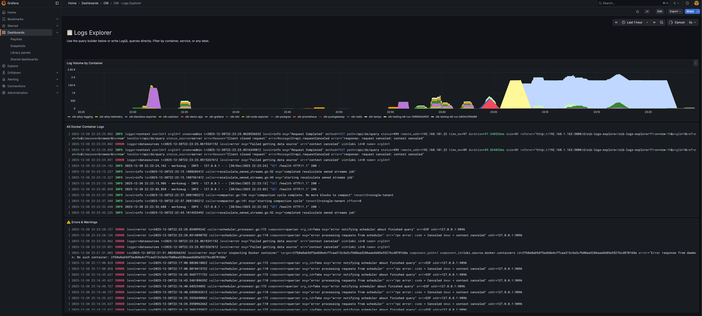
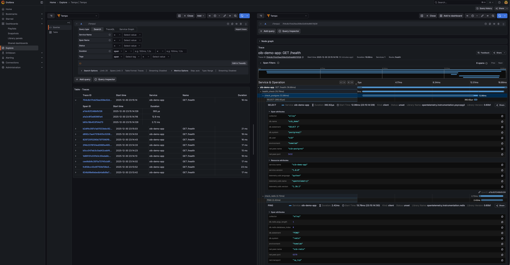
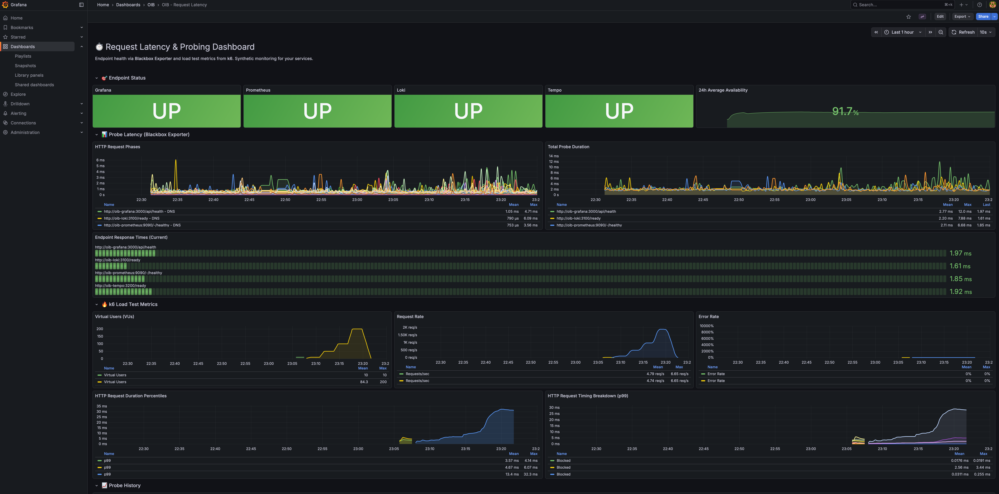
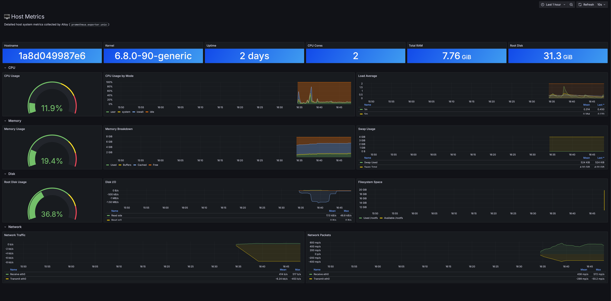

# 🔭 Observability in a Box

**A plug-and-play observability stack for developers. Zero config, production-ready patterns.**

Clone, run `make install`, and get instant observability for your projects using Grafana's LGTM stack (Loki, Grafana, Tempo, Prometheus).

<a href="https://github.com/matijazezelj/oib" class="btn">View on GitHub</a>
<a href="https://github.com/matijazezelj/oib#-quick-start" class="btn">Documentation</a>

---

## ⚡ Quick Start

```bash
# Clone and configure
git clone https://github.com/matijazezelj/oib.git && cd oib
cp .env.example .env  # Edit and set GRAFANA_ADMIN_PASSWORD

# Install and explore
make install
make demo
make open
```

That's it. Open [http://localhost:3000](http://localhost:3000) and start exploring your data.

---

## 📦 What's Included

| Stack | Components | What It Does |
|-------|------------|--------------|
| **Logging** | Loki + Alloy | Centralized log aggregation with automatic Docker log collection |
| **Metrics** | Prometheus + Alloy + cAdvisor | Host metrics via Alloy, container metrics via cAdvisor, endpoint probing |
| **Tracing** | Tempo + Alloy | Distributed tracing with OpenTelemetry support |
| **Profiling** | Pyroscope | Continuous profiling (optional: `make install-profiling`) |
| **Visualization** | Grafana | Pre-built dashboards for all four pillars |
| **Testing** | k6 | Load testing with metrics streaming to Prometheus |

---

## 🔌 Integration Endpoints

Once installed, your applications can send data to:

| Data Type | Endpoint | Protocol |
|-----------|----------|----------|
| **Traces** | `localhost:4317` | OTLP gRPC |
| **Traces** | `http://localhost:4318` | OTLP HTTP |
| **Profiles** | `http://localhost:4040` | Pyroscope SDK (optional) |
| **Logs** | Automatic | Docker containers are auto-collected |

---

## 📊 Pre-built Dashboards

OIB comes with six ready-to-use Grafana dashboards:

- **System Overview** — Container CPU/memory, disk usage, network I/O
- **Host Metrics** — Detailed host system metrics (CPU, memory, disk, network) via Alloy
- **Logs Explorer** — Log volume, live logs, errors/warnings panel
- **Traces Explorer** — TraceQL examples with code samples for Python, Node.js, Ruby, and PHP
- **Profiles Explorer** — CPU, memory, and goroutine profiling with Pyroscope
- **Request Latency** — Endpoint probing results and k6 load test metrics

---

## � How It Looks

### Dashboard Overview
All OIB dashboards organized in one folder, with tags for easy filtering.



### System Overview
Real-time CPU, memory, disk gauges plus per-container resource usage.


### Logs Explorer
Log volume by container, live log stream, and dedicated errors/warnings panel.



### Traces Explorer
Full distributed tracing with PostgreSQL, Redis, and HTTP spans visible.



### Request Latency & Probing
Endpoint health status, probe latency breakdown, and k6 load test metrics.



### Host Metrics
Detailed host system metrics: CPU, memory, disk I/O, filesystem, and network.



### Profiles Explorer
Continuous profiling with flame graphs to find performance bottlenecks.


---

## 📖 The Story Behind OIB

I've spent 25 years in infrastructure. Started as a sysadmin, moved through DevOps, now I'm in SecOps. Along the way I've worked on systems handling petabytes of data and hundreds of thousands of requests per second.

And in all that time, one thing hasn't changed: **most developers have no idea how their application actually behaves in production.**

I don't mean that as criticism. It's not their job to know the internals of Prometheus or wrestle with Loki configurations. They're busy writing features, fixing bugs, shipping code. But the gap between "it works on my machine" and "it works at scale" is where careers get made or broken — and where outages happen at 3 AM.

### The Pattern I Keep Seeing

A dev writes an app. It works locally. It passes CI. It gets deployed. Then, weeks later:

- "Why is the API slow?"
- "Is this endpoint even being used?"
- "What was happening when that error occurred?"
- "How much memory does this thing actually need?"

Nobody knows. There's no observability. Maybe there's some basic logging that writes to stdout and disappears into the void. Maybe someone set up metrics once but the Grafana dashboard is broken and nobody remembers the password.

So everyone's flying blind, and when something breaks, the debugging process is pure archaeology.

### Why Observability Gets Skipped

Setting up proper observability is annoying. You need:

- A metrics stack (Prometheus, exporters, maybe a pushgateway)
- A logging stack (Loki or Elasticsearch, log shippers, retention policies)
- A tracing stack (Tempo or Jaeger, instrumentation, sampling)
- Grafana to visualize all of it
- Everything wired together correctly
- Dashboards that actually show useful information

That's a lot of YAML. A lot of documentation. A lot of "I'll do it later" that turns into never.

I get it. I've set this up dozens of times and it still takes me a few hours to do it right. For someone who just wants to see if their app is healthy, the barrier is too high.

### So I Built OIB

It's a single repo that gives you the complete Grafana LGTM stack configured and ready to go. Clone it, run `make install`, and you have production-grade observability.

The whole thing runs in Docker. It's designed for local development and self-hosted environments, but the patterns scale — this is the same stack running in production at companies you've heard of.

---

## 👥 Who This Is For

- **Developers** who want to understand how their app behaves without becoming observability experts
- **Self-hosters** who want proper monitoring without the enterprise complexity
- **Small teams** who need observability but don't have dedicated SRE staff
- **Anyone learning** about metrics, logs, and traces in a hands-on way

---

## 🛠️ Commands Reference

```bash
# Installation
make install              # Install all stacks
make install-logging      # Install logging stack only
make install-metrics      # Install metrics stack only
make install-telemetry    # Install telemetry stack only

# Health & Status
make health               # Quick health check
make status               # Show all services
make doctor               # Diagnose common issues

# Demo & Testing
make demo                 # Generate sample data
make demo-app             # Start demo app with PostgreSQL & Redis
make test-load            # Run k6 load test

# Maintenance
make update               # Pull latest images and restart
make latest               # Run with :latest image tags
make logs                 # Tail all logs
make uninstall            # Remove everything
```

---

## 💻 Example Integration

### Python (Flask with OpenTelemetry)

```python
from opentelemetry import trace
from opentelemetry.exporter.otlp.proto.grpc.trace_exporter import OTLPSpanExporter
from opentelemetry.sdk.trace import TracerProvider
from opentelemetry.sdk.trace.export import BatchSpanProcessor

provider = TracerProvider()
exporter = OTLPSpanExporter(endpoint="localhost:4317", insecure=True)
provider.add_span_processor(BatchSpanProcessor(exporter))
trace.set_tracer_provider(provider)

tracer = trace.get_tracer(__name__)

@app.route('/api/users')
def get_users():
    with tracer.start_as_current_span("get-users"):
        # Your code here
        return users
```

### Node.js (Express with OpenTelemetry)

```javascript
const { NodeSDK } = require('@opentelemetry/sdk-node');
const { OTLPTraceExporter } = require('@opentelemetry/exporter-trace-otlp-grpc');

const sdk = new NodeSDK({
  traceExporter: new OTLPTraceExporter({
    url: 'http://localhost:4317',
  }),
  serviceName: 'my-node-app',
});
sdk.start();
```

### Docker Compose Integration

```yaml
services:
  my-app:
    environment:
      - OTEL_EXPORTER_OTLP_ENDPOINT=http://host.docker.internal:4318
      - OTEL_SERVICE_NAME=my-app
    networks:
      - oib-network

networks:
  oib-network:
    external: true
```

---

## � Running at Scale

OIB handles multiple application instances seamlessly. Here's how to run a scaled deployment:

### Docker Compose with Multiple Instances

```yaml
services:
  api:
    image: my-api:latest
    deploy:
      replicas: 3
    environment:
      - OTEL_EXPORTER_OTLP_ENDPOINT=http://oib-alloy-telemetry:4318
      - OTEL_SERVICE_NAME=api
      - OTEL_RESOURCE_ATTRIBUTES=service.instance.id={{.Task.Slot}}
    networks:
      - oib-network
      - default

  worker:
    image: my-worker:latest
    deploy:
      replicas: 5
    environment:
      - OTEL_EXPORTER_OTLP_ENDPOINT=http://oib-alloy-telemetry:4318
      - OTEL_SERVICE_NAME=worker
      - OTEL_RESOURCE_ATTRIBUTES=service.instance.id={{.Task.Slot}}
    networks:
      - oib-network
      - default

  nginx:
    image: nginx:alpine
    ports:
      - "80:80"
    volumes:
      - ./nginx.conf:/etc/nginx/nginx.conf:ro
    depends_on:
      - api
    networks:
      - oib-network
      - default

networks:
  oib-network:
    external: true
```

### Scale with Docker Compose

```bash
# Start with 3 API instances and 5 workers
docker compose up -d --scale api=3 --scale worker=5

# Scale up during peak hours
docker compose up -d --scale api=10 --scale worker=20

# Scale down
docker compose up -d --scale api=2 --scale worker=3
```

### What You'll See in Grafana

With multiple instances, OIB gives you:

**Traces** — Each request shows the full journey across instances:
```
[nginx] → [api-1] → [worker-3] → [postgres]
[nginx] → [api-2] → [worker-1] → [redis]
```

**Metrics** — Per-instance breakdown:
- CPU/memory usage per container instance
- Request rate per instance
- Error rate distribution across instances

**Logs** — Correlated by trace ID:
```logql
{service_name="api"} | json | trace_id="abc123"
```

### Querying Across Instances

**Find slow instances (TraceQL):**
```
{ resource.service.name = "api" && duration > 500ms } | by(resource.service.instance.id)
```

**Compare instance performance (PromQL):**
```promql
histogram_quantile(0.95, 
  sum by (instance, le) (
    rate(http_request_duration_seconds_bucket{service="api"}[5m])
  )
)
```

**Aggregate logs from all instances:**
```logql
{service_name="api"} | json | level="error" | line_format "{{.instance}}: {{.message}}"
```

---

## �💡 The Real Point

Observability shouldn't be a barrier. You shouldn't need to read 50 pages of documentation just to see how much memory your app is using.

I built OIB because I was tired of watching smart people debug production issues with `print` statements and hope. The tools exist. They're free. They just need to be easier to set up.

**If you've ever wondered what your app is actually doing once it leaves your laptop — [give it a try](https://github.com/matijazezelj/oib).**

---

## 🔗 Links

- **GitHub Repository**: [github.com/matijazezelj/oib](https://github.com/matijazezelj/oib)
- **Full Documentation**: [README](https://github.com/matijazezelj/oib#readme)
- **Examples**: [Python, Node.js, Ruby, PHP](https://github.com/matijazezelj/oib/tree/main/examples)

---

*Questions or feedback? Find me on Reddit: [u/matijaz](https://reddit.com/u/matijaz). If you build something cool with OIB, I'd love to hear about it.*
